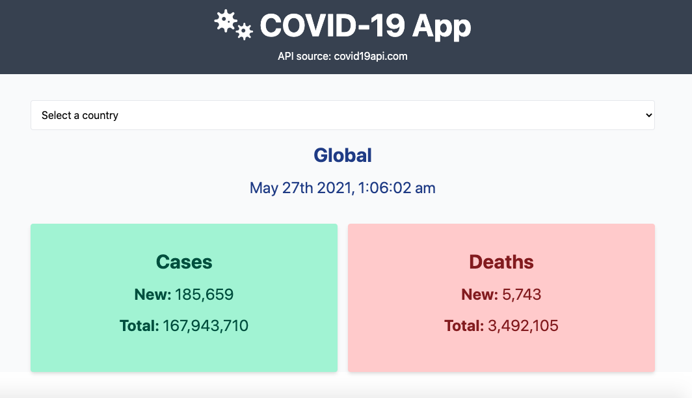

# COVID App



App that allows to track information related to COVID-19 by country (positive cases and deaths). API used: https://covid19api.com

## Project setup
```
npm install
```

### Compiles and hot-reloads for development
```
npm run serve
```

### Compiles and minifies for production
```
npm run build
```

### Customize configuration
See [Configuration Reference](https://cli.vuejs.org/config/).
